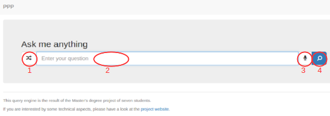



Some useful features that you should know.

1. Random generation of a question.
2. Text input of a question.
3. Speech input of a question.
4. Process a question.

## Examples of questions

#### Keyword questions

* [Sherlock Holmes](http://askplatyp.us/?lang=en&q=Sherlock+Holmes)

* [Guatemala](http://askplatyp.us/?lang=en&q=Guatemala)

#### English questions

* [Who is Jean-François Champollion?](http://askplatyp.us/?lang=en&q=Who+is+Jean-Fran%C3%A7ois+Champollion%3F)

* [What is "P=NP"?](http://askplatyp.us/?lang=en&q=What+is+%22P%3DNP%22%3F)

* [Who is the author of "Le Petit Prince"?](http://askplatyp.us/?lang=en&q=Who+is+the+author+of+%22Le+Petit+Prince%22%3F)

* [What is the capital of India?](http://askplatyp.us/?lang=en&q=What+is+the+capital+of+India%3F)

* [Where is the capital of New Zealand?](http://askplatyp.us/?lang=en&q=Where+is+the+capital+of+New+Zealand%3F)

* [Who is the prime minister of France?](http://askplatyp.us/?lang=en&q=Who+is+the+prime+minister+of+France%3F)

* [What is the birth date of the president of the United States?](http://askplatyp.us/?lang=en&q=What+is+the+birth+date+of+the+president+of+the+United+States%3F)

* [Who are the Beatles\' members?](http://askplatyp.us/?lang=en&q=Who+are+the+Beatles%27+members%3F)

* [When was Barack Obama born?](http://askplatyp.us/?lang=en&q=When+was+Barack+Obama+born%3F)

#### Math questions

* [sqrt(180)](http://askplatyp.us/?lang=en&q=sqrt(180))

* [integral of sin(x)](http://askplatyp.us/?lang=en&q=integral+of+sin%28x%29)

* [N[Pi, 42]](http://askplatyp.us/?lang=en&q=N%5BPi%2C+42%5D)

* [Limit[Sum[1/i, {i,1,n}]-Log[n], n->Infinity]](http://askplatyp.us/?lang=en&q=Limit%5BSum%5B1%2Fi%2C+%7Bi%2C1%2Cn%7D%5D-Log%5Bn%5D%2C+n-%3EInfinity%5D+)

* [Integrate[Sin[x\*y], {x, 0, 1}, {y, 0, x}]](http://askplatyp.us/?lang=en&q=Integrate%5BSin%5Bx*y%5D%2C+%7Bx%2C+0%2C+1%7D%2C+%7By%2C+0%2C+x%7D%5D+)

* [Sum[x^n/n!, {n,0,Infinity}]](http://askplatyp.us/?lang=en&q=Sum%5Bx%5En%2Fn!%2C+%7Bn%2C0%2CInfinity%7D%5D+)

* [sum(1/n**42, n, 1, infinity)](http://askplatyp.us/?lang=en&q=Sum%5B1%2Fn%5E42%2C+%7Bn%2C1%2CInfinity%7D%5D+)

* [Integrate[Exp[-x^2], {x, -Infinity, Infinity}]](http://askplatyp.us/?lang=en&q=Integrate%5BExp%5B-x%5E2%5D%2C+%7Bx%2C+-Infinity%2C+Infinity%7D%5D+)

* [Solve[Exp[x]/2+Exp[-x]/2==y,x]](http://askplatyp.us/?lang=en&q=+Solve%5BExp%5Bx%5D%2F2%2BExp%5B-x%5D%2F2%3D%3Dy%2Cx%5D)

* [What follows 2, 3, 5, 7, 11, 13, 17, 19, 23, 29, 31](http://askplatyp.us/?lang=en&q=What+follows+2%2C+3%2C+5%2C+7%2C+11%2C+13%2C+17%2C+19%2C+23%2C+29%2C+31)

#### Weird questions

* [What is the cappyttal of Franse?](http://askplatyp.us/?lang=en&q=What+is+the+cappyttal+of+Franse%3F)

* [Who are the daughters of the wife of the husband of the wife of the president of the United States?](http://askplatyp.us/?lang=en&q=Who+are+the+daughters+of+the+wife+of+the+husband+of+the+wife+of+the+president+of+the+United+States%3F)

## Power user input

You can also input your questions using our power user's query syntax. It may be used as a query tool for Wikidata.

### Examples

* [`(Barack Obama, birth date, ?)`](http://askplatyp.us/?lang=en&q=%28Barack+Obama%2C+birth+date%2C+%3F%29) Returns the birth date of the entities that have as label *Barack Obama*.

* [`(?, author, Douglas Adams)`](http://askplatyp.us/?lang=en&q=%28%3F%2C+author%2C+Douglas+Adams%29) Returns all the entities that have as author an entity with the label *Douglas Adams*.

* [`(?, profession, poet) ∩ (?, profession, computer scientist) ∩ (?, sex, female`)](http://askplatyp.us/?lang=en&q=%28%3F%2C+profession%2C+poet%29+%E2%88%A9+%28%3F%2C+profession%2C+computer+scientist%29+%E2%88%A9+%28%3F%2C+sex%2C+female%29) Does a clever intersection between the sets of entities returned by the three seb-queries to find Ada Lovelace.

* [`(Barack Obama, birth date, ?) ∪ (Bill Clinton, birth date, ?)`](http://askplatyp.us/?lang=en&q=%28Barack+Obama%2C+birth+date%2C+%3F%29+%E2%88%AA+%28Bill+Clinton%2C+birth+date%2C+%3F%29) A not so interesting union.

* [`((United States, president, ?), children, ?)`](http://askplatyp.us/?lang=en&q=%28%28United+States%2C+president%2C+%3F%29%2C+children%2C+%3F%29) Returns the children of the president of the United States using a nested query.
