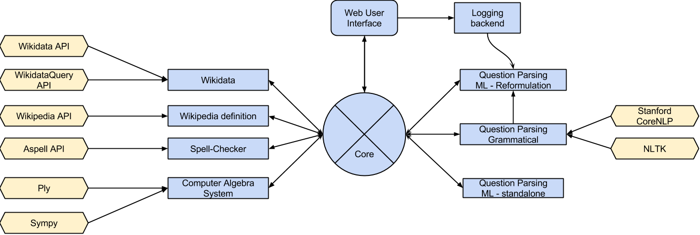



## The project

*Projet Pensées Profondes* are three french words, which mean literaly *Deep
Thought Project* in English.

This project aims to propose a natural language question answering framework. You can test
it [here](http://ppp.pony.ovh/).

For a more detailed overview of what we plan, read our [proposal](proposal.pdf).

First achievements, after about one month and a half, are written in the [midterm report](midtermReport.pdf).

This project is hosted on [GitHub](https://github.com/ProjetPP).

## Who are we?

We are Marc, Quentin, Raphaël, Thomas, Tom, Valentin and Yassine, 
seven students in first year of the theoretical computer science master, 
at the [École Normale Supérieure de Lyon](http://www.ens-lyon.fr/DI/).

This project takes place in our school program, from September 2014 to December 2014.
It will of course be kept on going after this date.
External contributions are allowed and welcome!
