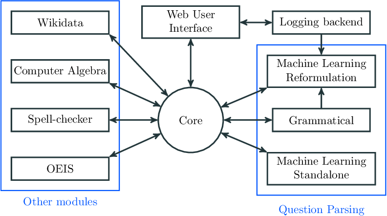



A modular and open source question answering framework.

<a class="btn btn-large" style="font-size: 25px;" href="http://ppp.pony.ovh/">Try Platypus </a>

<a href="demo.html">Learn</a> quickly how to use the PPP.

A presentation of the project will be held at the ENS Lyon on __December 18, 2014 from 9h30 to 10h00__
([more information](http://www.ens-lyon.eu/actualites/dppi-2014-les-demos-publiques-projets-integres-des-m1-en-informatique-248516.kjsp?RH=ENS-LYON-FR-AGENDA)).

## The project

*Projet Pensées Profondes* are three french words, which mean literaly *Deep
Thought Project* in English.

This project resulted in the creation of a question answering framework, *Platypus*.

First achievements, after about one month and a half, are written in the [midterm report](documentation/midtermReport.pdf).

